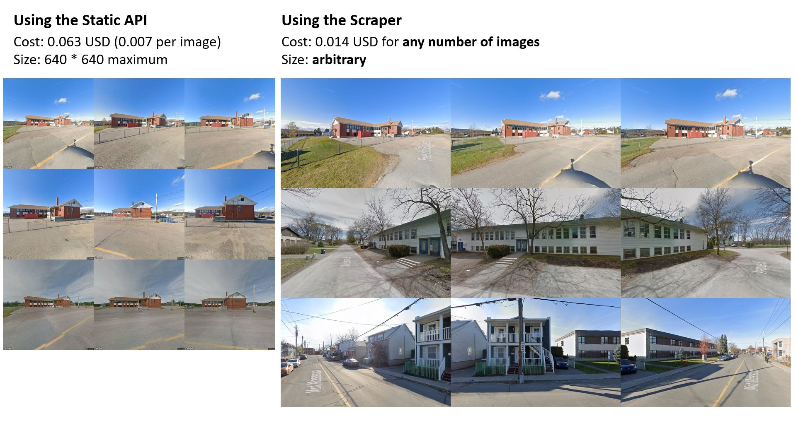

# Streetview Scraper v2: arbitrary size Street View images for almost free





Features:
- Basically free scraping of Street View images (0.014 USD per worker initialization).
- Launch multiple workers in parallel.
- Get multiple angles and different time periods for each location.
- Arbitrarily sized images without watermarks.

Note: You will need a [Google Maps API key](https://developers.google.com/maps/documentation/javascript/get-api-key).

Check the blog post for a full breakdown: [https://loichovon.com/posts/streetview-scraper-v2.html](https://loichovon.com/posts/streetview-scraper-v2.html)


## Setup

```sh
python -m venv .venv
.venv\Scripts\active # Windows
source .venv\bin\activate # Mac/Linux
pip install requirements.txt
```

Copy the example `.env` file and enter your Maps API key.
```sh
cp .env.example .env 
```

## Usage

First, start the server. The client tries to connect to it at `http://127.0.0.1:5000` by default.
Update `StreetviewScreenshotClient::screenshot()` in `client.py` if you want to change the server's address.
```sh
flask --app server.py run
```

Then launch the client.
```sh
python client.py -h
usage: client.py [-h] [-n NUM_WORKERS] [-s IMAGE_SIZE] [-b]

optional arguments:
  -h, --help            show this help message and exit
  -n NUM_WORKERS, --num-workers NUM_WORKERS
                        Number of parallel workers to launch
  -s IMAGE_SIZE, --image-size IMAGE_SIZE
                        Width,height dimensions of images scraped
  -b, --show-browser    Show the browser windows.
```

Change `client.py` to get your locations of interest from a file or a database and scrape away!